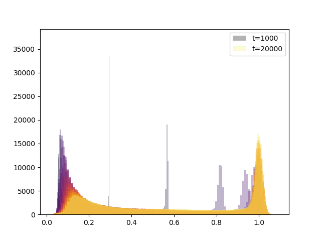
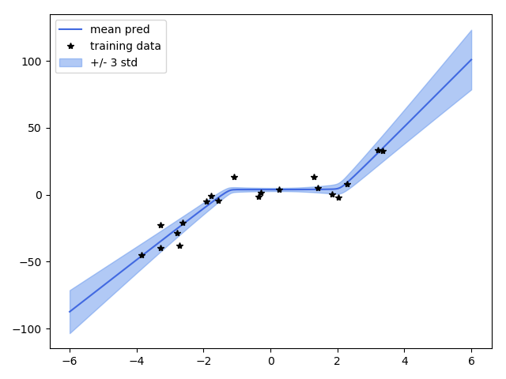

# Bayes by Backprop implementation Sonnet + Tensorflow + tf.distributions

Implementation of 'Bayes by Backprop' from Blundell et al. (2015) using Tensorflow, tf.distributions and Sonnet. Two examples are included, applying the Bayesian NN model to MNIST and to a simplified regression problem.

### Results

The network (MLP with two hidden layers of 200 units each, ReLU activation) achieves ~98-98.2% performance on MNIST. The distribution of the standard deviations of all weights in the network throughout training is shown in the figure below.

Regression problem, fitting a cubic curve ($y=x^3$) with an MLP network with a single hidden layer of 100 ReLU units.

### References.

Blundell, C., Cornebise, J., Kavukcuoglu, K., & Wierstra, D. (2015). Weight uncertainty in neural networks. arXiv preprint arXiv:1505.05424.

LeCun, Y. (1998). The MNIST database of handwritten digits. http://yann. lecun. com/exdb/mnist/.

